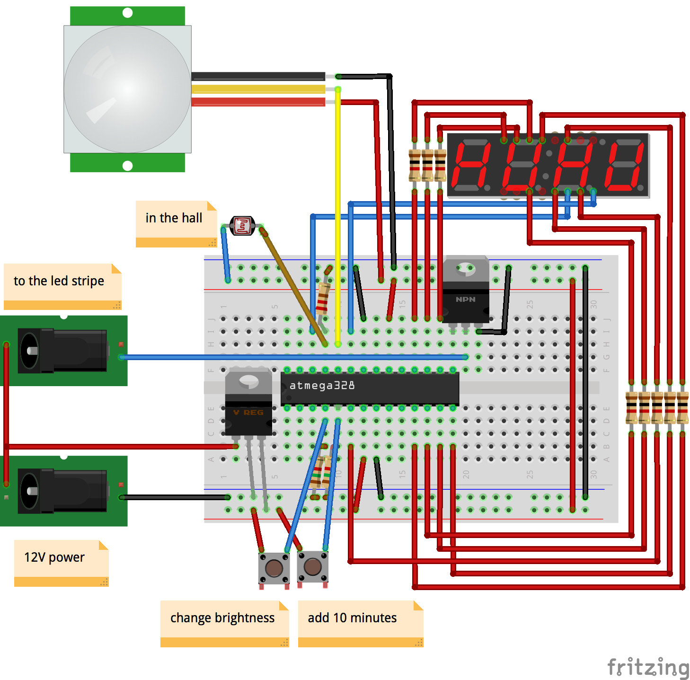

# Automatic LED light in my bathroom  #

It's so much useful so I even removed regular bulb — it became redundant. 

## Features ##

<ul>
<li>Automatic night mode 😴 (When it's dark in the apartment — turn on with 1% power) </li>
<li>On motion detection trigger for N minutes (prolongation works)</li>
<li>Buttons to change brightness or add 10 more minutes</li>
<li>Automatically fades in and out</li>
<li>Covered with tests! 🚀</li>
<li>Modular source code 🔥</li>
</ul>

## "I have another microcontroller!", "I have Arduino board instead"... ##

It's okay. This code was initially written for Arduino Nano and later moved to single ATMega328 processor. Just change pins definition and you're done. It should be even compatible with ATTiny processors.

## License ##

MIT
